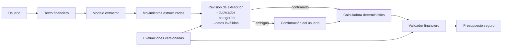

# Arquitectura confiable de SpendWise AI

SpendWise separa interpretación y cálculo para que el modelo no sea la fuente
de verdad de los números. Gemini propone movimientos estructurados; el código
revisa su calidad, calcula el presupuesto y valida la coherencia final.

## Responsabilidades

- **Modelo extractor:** interpreta el texto y propone descripción, monto y
  categoría. No calcula totales ni decide si una repetición es válida.
- **Revisión de extracción:** identifica datos faltantes, categorías fuera del
  contrato y posibles duplicados; las ambigüedades requieren confirmación.
- **Calculadora determinística:** suma únicamente movimientos confirmados y
  obtiene gasto, saldo, porcentaje y categoría principal.
- **Validador financiero:** comprueba el contrato de salida y que categorías,
  saldo y porcentaje correspondan a las cifras recalculadas.

Una recomendación solo se genera después de que el presupuesto pase las dos
validaciones. Si falta ingreso o hay una ambigüedad, la salida debe pedir el
dato al usuario en vez de completar números por cuenta propia.
