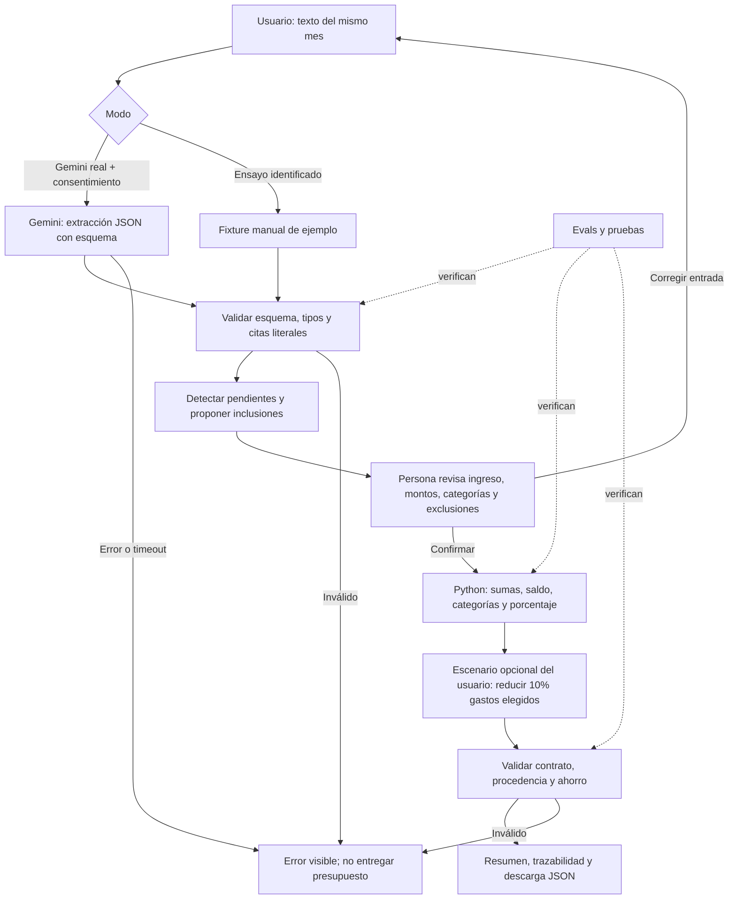

# Arquitectura de SpendWise AI

## Canal elegido: web app local

La entrega es una aplicación web accesible desde navegador y ejecutada con Python. Su objetivo es demostrar ingreso de texto, interpretación, revisión y resultado en seis minutos. Se eligió una interfaz HTML/CSS/JavaScript con servidor de biblioteca estándar porque arranca sin instalar paquetes y permite mostrar una tabla editable. Una app móvil requeriría empaquetado e instalación sin mejorar esta prueba; una API sola no haría visible la decisión humana. Gradio figuraba como dependencia del notebook anterior, pero no había interfaz implementada.

## Flujo implementado



## Responsabilidades reales

| Componente | Responsabilidad | Frontera |
|---|---|---|
| Navegador | Entrada, consentimiento, corrección, confirmación, visualización y descarga | No recibe la API key ni decide cifras por sí solo |
| `call_gemini` | Una llamada REST con esquema JSON, timeout de 40 segundos y manejo de errores | Interpreta; no calcula ni aconseja |
| `validate_extraction` | Campos exactos, tipos, moneda, categoría y citas presentes en el texto | No demuestra que la semántica sea correcta |
| `prepare_review` | Incidencias explícitas, exclusiones conservadoras y preview provisional | Nunca marca confirmación humana automáticamente |
| `confirm_review` | Confirmación obligatoria, mismos IDs, correcciones y exclusiones | Bloquea devoluciones/monedas extranjeras incluidas |
| `calculate_financials` | Aritmética decimal, categorías, saldo y porcentaje | No interpreta lenguaje natural |
| `build_output` | Escenario de reducción elegido por usuario | El modelo no inventa ahorro ni determina qué gasto es reducible |
| `validate_financial_output` | Contrato, sumas, tipos, escenario y fuente de movimientos | No equivale a evaluación de utilidad con usuarios |

## AI native y baseline sin IA

La tarea del modelo es transformar descripciones variables en un inventario estructurado con citas. Ejemplo: “Me entraron 1.2 millones; pagué 50 mil de mercado y 12.500 de bus”. Sin el modelo, la persona debe separar montos y escoger categorías en un formulario o una hoja de cálculo. La hipótesis de valor es reducir ese esfuerzo sin aumentar errores finales; todavía debe medirse.

La IA no aparece como un chat agregado al final: su salida alimenta el flujo de revisión y los cálculos. Una sola llamada es suficiente para la función central. Se retiró la generación libre de recomendaciones numéricas de la versión anterior para evitar ahorros sin soporte; el usuario elige un escenario y el código deriva cada cifra.

## Contratos y unidades

Entrada: texto de un mismo periodo, hasta 12.000 caracteres. Se permiten hasta 100 movimientos. Moneda base COP; montos finitos no negativos y hasta dos decimales. Ingreso ausente es `null`; no se transforma en cero.

Extracción: `ingreso_total`, `fuente_ingreso`, `movimientos`, `incidencias`. Cada movimiento tiene descripción, monto nullable, categoría nullable, moneda, tipo expense/refund y cita literal. El servidor asigna IDs de sesión; no confía en IDs del modelo.

Salida financiera: los once campos definidos en `spendwise_core.REQUIRED_FIELDS`. La respuesta de aplicación envuelve ese output con movimientos confirmados, IDs corregidos/excluidos y metadatos del modo usado. Ese envoltorio no altera el contrato financiero.

```text
gasto_total = suma de valores de movimientos incluidos
saldo_disponible = ingreso_total - gasto_total (o null sin ingreso)
porcentaje_gastado = round_half_up(gasto_total / ingreso_total * 100, 2)
ahorro_potencial = suma de reducciones de 10% seleccionadas por el usuario
```

Porcentaje `null` con ingreso cero o ausente. `Decimal` evita artefactos de sumar floats, y el redondeo explícito hace reproducibles los resultados. No hay conversiones de moneda ni conciliación de devoluciones.

## Incertidumbre

- Monto faltante: fila visible excluida inicialmente; completar monto e incluir o aceptar resumen parcial.
- Duplicados por descripción normalizada: excluir inicialmente ambos; la persona puede incluir uno o confirmar que son distintos.
- Categoría desconocida: preservar monto en `otros`, mostrar incidencia y pedir revisión.
- Moneda extranjera o devolución: no permitir inclusión directa; corregir la entrada después de conciliación externa.
- Ingreso faltante: pedir dato o aceptar saldo/porcentaje no disponibles.
- Saldo negativo: advertir; no recomendar préstamos ni inversiones.
- Respuesta malformada, sin citas o error del proveedor: bloquear y explicar.

Se añaden señales conservadoras para frases como “no recuerdo cuánto”, “me devolvieron” y “no recuerdo qué compré”, incluso si la extracción omitió la incidencia. Estas señales no sustituyen comprensión semántica. Duplicados con descripciones distintas, magnitudes mal interpretadas y omisiones sin esas frases siguen siendo riesgos; la revisión de todos los movimientos es obligatoria.

## Estado, seguridad y operación

API key solo en el proceso servidor; API local enlazada a loopback. Sesiones aleatorias en memoria, máximo 100, TTL 30 minutos con limpieza periódica y borrado explícito. Origen/Host verificados; JSON obligatorio; rutas estáticas en lista permitida; CSP; texto del modelo renderizado como texto, nunca HTML. Entradas no se escriben a logs. Un error no activa simulación automáticamente.

No hay despliegue público, autenticación, multiusuario real, cifrado de almacenamiento ni acceso bancario. Antes de producción se requieren estas decisiones, revisión de privacidad, límites de consumo, monitoreo y validación representativa. La retención de Gemini no está controlada por el servidor local.

## Evidencia

`evals/results.md` distingue histórico, pruebas offline y evaluación real pendiente. `python verify.py` reproduce gates técnicos; `python -m evals.run_evals --live --ask-key --repeat 3` ejecuta el nuevo pipeline contra Gemini. Los reportes incluyen hashes y prompt versionado. Los fixtures no prueban precisión del modelo.
