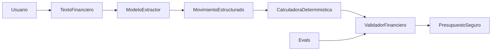

# Arquitectura de SpendWise AI

## Diagrama obligatorio



La frontera principal es que **el modelo no calcula los totales finales**. Gemini interpreta el texto y extrae movimientos estructurados; después, el código recalcula el gasto total, las categorías, el saldo y el porcentaje gastado. El resultado solo se entrega si pasa la validación financiera.

Esta arquitectura no depende todavía de elegir una aplicación web, móvil o una API. Cualquiera de esos canales podría utilizar el mismo núcleo sin cambiar la frontera entre IA, código y decisión humana.

## ¿Qué problema resuelve?

SpendWise AI ayuda a estudiantes universitarios y jóvenes profesionales que registran gastos de manera informal, pero no tienen una lectura clara de su presupuesto. Convierte descripciones en lenguaje natural en movimientos estructurados y en un resumen verificable para entender en qué se gasta el dinero.

La dificultad no es únicamente sumar. El sistema debe interpretar entradas variables como “50 mil de mercado”, reconocer información incompleta y evitar que una ambigüedad se convierta en una cifra aparentemente confiable.

## ¿Qué entra al sistema?

La entrada es texto escrito por el usuario que puede contener:

- ingreso del periodo, si está disponible;
- descripción y valor de cada gasto;
- moneda de los movimientos;
- abreviaciones, expresiones informales o correcciones.

Por ejemplo:

```text
Me entraron 1.2 millones COP. Pagué $50 mil de mercado y 12.500 de bus.
```

El texto se trata como información no confiable. Una instrucción incluida por el usuario no puede cambiar las reglas del sistema.

## ¿Qué hace la IA?

Gemini realiza dos trabajos acotados. `extract_movements` interpreta el texto y propone el ingreso, los movimientos, las categorías y las posibles ambigüedades. `generate_recommendations` redacta opciones usando solamente los movimientos y el resumen ya calculado.

La IA no suma categorías, no calcula el saldo ni produce el porcentaje final. Tampoco debe inventar movimientos, convertir monedas sin una tasa confirmada o tomar decisiones por el usuario.

## ¿Qué valida el código?

`calculate_financials` recalcula todos los números a partir de los movimientos aceptados. Después, `validate_financial_output` comprueba:

- presencia de todos los campos requeridos y ausencia de campos inesperados;
- tipos numéricos válidos;
- coincidencia entre la suma de categorías y `gasto_total`;
- coincidencia entre ingreso menos gastos y `saldo_disponible`;
- coincidencia del porcentaje con la fórmula financiera;
- uso de `null` cuando el ingreso falta o no permite calcular el porcentaje.

Si alguna condición falla, el resultado se bloquea y se reportan los errores. El sistema no corrige silenciosamente una inconsistencia.

## ¿Qué output recibe el usuario?

El usuario recibe un JSON estructurado con ingreso total, gasto total, saldo disponible, porcentaje gastado, totales por categoría, categoría de mayor gasto, gastos reducibles, oportunidades de ahorro, ahorro potencial, recomendación principal y estado financiero.

En una versión de producto también debe ver los movimientos interpretados y las advertencias pendientes. La persona confirma los datos ambiguos y conserva la decisión final sobre las recomendaciones.

## ¿Qué riesgos tiene?

- Interpretar mal una magnitud por sus separadores o por expresiones informales.
- Omitir un gasto sin monto en lugar de solicitar el dato.
- Tratar una devolución como gasto negativo sin conocer la compra asociada.
- Inventar una categoría cuando la descripción no contiene información suficiente.
- Mezclar monedas sin una tasa de cambio confirmada.
- Seguir instrucciones maliciosas incluidas en el texto financiero.
- Entregar números consistentes calculados sobre movimientos incompletos.
- Exponer información financiera o la API key mediante almacenamiento inseguro.

## ¿Qué evidencia tenemos de que funciona?

Los casos están versionados en `evals/eval_cases.json`, sus resultados se encuentran en `evals/results.md` y la ejecución real está guardada en `SpendWiseAI.ipynb`.

- El baseline obtuvo **4/5** y falló al sumar dos arriendos ambiguos.
- Después de separar extracción, cálculos y recomendaciones, la suite original obtuvo **5/5**.
- La suite ampliada obtuvo **8/11**.
- Pasaron los casos de ingreso cero, formatos coloquiales y monedas mezcladas.
- Fallaron gasto sin monto, devolución y categoría ambigua porque los números cuadraron, pero el sistema no pidió confirmación.

Esta evidencia muestra que los cálculos deterministas y los primeros guardrails funcionan, pero no demuestra que el producto esté listo para producción. Los tres fallos indican que todavía debemos validar la incertidumbre de la extracción y probar el flujo con usuarios reales.

## Responsabilidades

| Componente | Responsabilidad | No debe hacer |
|---|---|---|
| `ModeloExtractor` / `extract_movements` | Interpretar el ingreso, los gastos, sus categorías y las ambigüedades | Sumar gastos, convertir monedas sin tasa o inventar valores |
| `CalculadoraDeterministica` / `calculate_financials` | Sumar movimientos aceptados y calcular saldo, porcentaje y totales por categoría | Interpretar texto o generar recomendaciones |
| `ValidadorFinanciero` / `validate_financial_output` | Verificar campos, tipos, suma de categorías, saldo y porcentaje | Corregir silenciosamente una respuesta inconsistente |
| `Evals` | Comparar el resultado con casos y valores esperados | Sustituir pruebas con usuarios reales |
| Usuario | Confirmar datos ambiguos y decidir si aplica recomendaciones | Delegar automáticamente decisiones financieras al modelo |

## Fuente de verdad

Los movimientos confirmados son la fuente de verdad de los gastos. Una cifra propuesta por Gemini nunca reemplaza los cálculos deterministas:

```text
gasto_total = suma de categorias
saldo_disponible = ingreso_total - gasto_total
porcentaje_gastado = gasto_total / ingreso_total * 100
```

Si falta el ingreso, el saldo y el porcentaje deben ser `null`. Si el ingreso es cero, el porcentaje también debe ser `null` para evitar una división por cero.

## Manejo de incertidumbre

Los movimientos dudosos se excluyen hasta que la persona los confirme. Esto incluye:

- dos valores que podrían corresponder al mismo gasto;
- un gasto mencionado sin monto;
- una moneda diferente sin tasa de cambio confirmada;
- una devolución sin información suficiente sobre la compra asociada.
- un movimiento con valor conocido, pero sin información suficiente para asignar una categoría.

El sistema puede calcular un resumen parcial con los movimientos válidos, pero debe explicar qué dato quedó pendiente.

## Falla probable en usuarios reales

La falla más probable ocurre durante la extracción. Un usuario puede escribir abreviaciones, corregir un valor en la misma frase, mezclar separadores o usar monedas distintas. Gemini podría omitir un movimiento o interpretar mal su magnitud. En ese escenario, el código haría correctamente las operaciones sobre movimientos incorrectos y produciría un resultado internamente consistente, pero falso.

Por eso, una versión de producto debe mostrar los movimientos extraídos antes del resumen final para que la persona pueda confirmarlos o corregirlos.

## Qué falta para producción

- Una interfaz para confirmar o corregir movimientos extraídos.
- Un esquema estricto para validar la extracción antes de calcular.
- Pruebas unitarias independientes de Gemini y evals repetidos para medir variabilidad.
- Manejo visible de cuota, timeout, respuestas inválidas y caída de la API.
- Protección de datos financieros, control de acceso y política de retención.
- Monitoreo de movimientos omitidos, duplicados y correcciones de usuarios.

## Evidencia actual

La suite original mejoró de **4/5** a **5/5**. Después de la retroalimentación se agregaron casos más difíciles y la suite actual llegó a once. La ejecución obtuvo **8/11**: fallaron el gasto sin monto, la devolución y la categoría ambigua porque los resultados fueron matemáticamente consistentes, pero no solicitaron confirmación. Esto demuestra que validar las operaciones no basta; también es necesario validar que la incertidumbre se comunique al usuario.
