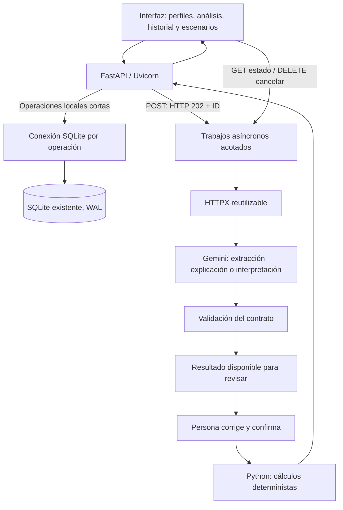

# Arquitectura actual de SpendWise AI

Actualizada para el refactor del 23 de septiembre de 2026. El notebook y los materiales de la presentación anterior se conservan como documentación académica; esta página y README describen la implementación actual.

## Problema eliminado

El servidor anterior usaba `LOCK` al seleccionar perfil y llamaba dentro a `_get_active_profile`, que intentaba adquirir el mismo `threading.Lock`. Con una cookie activa, el hilo quedaba bloqueado indefinidamente. `service_actions` intentaba adquirir ese candado y podía detener el bucle de atención del servidor. Esto explica que operaciones sin IA también vencieran por timeout.

Cambiar únicamente el tiempo máximo de espera no habría corregido ese bloqueo. Ahora sesiones y trabajos se gestionan en el event loop sin candados anidados. SQLite no comparte una única conexión entre solicitudes; las operaciones se ejecutan en el threadpool y cierran su conexión al terminar.

## Fronteras

| Capa | Responsabilidad |
|---|---|
| `web/api.js` | Peticiones breves, polling, cancelación, errores y respuestas obsoletas |
| `web/app.js` | Edición, confirmación, navegación y visualización |
| `spendwise_api.py` | Perfil/sesión, validación, rutas, acceso a datos y coordinación |
| `spendwise_jobs.py` | Cola acotada, deadline, deduplicación y propiedad del resultado |
| `spendwise_provider.py` | Conexiones HTTPX, API key, errores y parsing Gemini |
| `spendwise_service.py` | Prompts, contratos, incertidumbre y revisión financiera |
| `spendwise_core.py` | Montos decimales, totales, porcentaje y escenarios |
| `spendwise_storage.py` | Persistencia en transacciones, sin llamar a Gemini |
| `spendwise_compare.py` | Diferencias entre meses, sin llamar a Gemini |

La extracción, explicación y planificación llaman al mismo transporte; ya no hay tres implementaciones HTTP duplicadas. El adaptador síncrono se conserva para notebook y evals, pero el servidor usa el cliente asíncrono persistente.

## Presupuesto de latencia

- Solicitud local del navegador: hasta 8 segundos; normalmente mucho menos.
- Conexión con proveedor: 5 segundos; lectura: 25 segundos.
- Trabajo de IA: máximo total 40 segundos, incluyendo cola y reintento.
- Polling: cada 700 ms. La respuesta al POST es 202 y no espera la generación.
- Límite: dos ejecuciones Gemini concurrentes, ocho trabajos activos y dos por sesión.
- Un reintento para 502/503/504 con pausa de 0,5 s, siempre dentro del deadline.
- Sin reintento automático para cuota, clave, esquema o respuesta truncada.

Estos son límites de espera, no promesas de duración de Gemini. Se mide tiempo local con `Server-Timing`; el resultado del proveedor incluye latencia, intentos y uso de tokens cuando Gemini los informa. El benchmark usa un proveedor demorado de prueba y no se extrapola a la nube.

## Perfiles, persistencia y revisión

Una cookie HttpOnly/SameSite identifica la sesión local. El perfil se resuelve en el servidor. Cambiarlo cancela trabajos, invalida revisiones y limpia las vistas; una respuesta tardía del perfil anterior se descarta. Las lecturas/escrituras filtran por propietario.

Los presupuestos existentes se conservan. SQLite usa WAL y conexión por operación. El reemplazo de un mes modifica sus movimientos dentro de una transacción, manteniendo ID y datos anteriores si se produce un error.

Las revisiones permanecen en memoria durante la sesión; los presupuestos guardados permanecen en disco. No hay cuentas autenticadas: los perfiles seleccionables son una separación local, no una garantía de acceso privado entre personas que usen la misma máquina.

## Escenarios y comparaciones

Las diferencias entre meses se calculan en Python. Gemini recibe una comparación reconstruida desde los presupuestos del servidor, no cifras arbitrarias enviadas por el navegador. Los movimientos ambiguos se muestran sin asumir que existen ambos lados de la coincidencia.

Las metas permiten editar objetivo y reducciones por movimiento. El servidor obtiene montos originales desde SQLite y rechaza reducciones que excedan el gasto. Los eventos exigen montos explícitos: vacío no significa cero. Ambos requieren confirmación de supuestos antes del cálculo. Los escenarios no se guardan como gasto confirmado ni alteran el presupuesto base.

La explicación en lenguaje natural sigue siendo una interpretación susceptible de error. Se validan estructura, IDs y tipos; la exactitud semántica de cada frase requiere revisión.

## Compatibilidad y alcance

La UI y la API ya no ofrecen datos simulados. Los fixtures se mantienen fuera del producto en `evals/` y `tests/`. No hay fallback silencioso a ejemplos.

Se preserva SQLite y el arranque `python app.py --ask-key`. Hay nuevas dependencias: FastAPI, Uvicorn, HTTPX y Pydantic. Después de actualizar, detener el servidor viejo, instalar `requirements.txt`, reiniciar y recargar el navegador.

El gestor de trabajos vive en un solo proceso. Se ejecuta con un worker; múltiples workers o despliegue distribuido requerirían un almacén de sesiones/cola compartido. No se añadió Redis, una base remota ni servicios que compliquen innecesariamente la demostración local.
