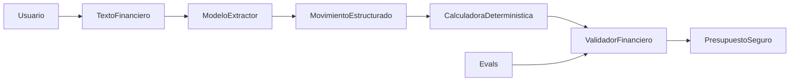

# Arquitectura de SpendWise AI

## Diagrama obligatorio



La frontera principal es que **el modelo no calcula los totales finales**. Gemini interpreta el texto y extrae movimientos estructurados; después, el código recalcula el gasto total, las categorías, el saldo y el porcentaje gastado. El resultado solo se entrega si pasa la validación financiera.

## Responsabilidades

| Componente | Responsabilidad | No debe hacer |
|---|---|---|
| `ModeloExtractor` / `extract_movements` | Interpretar el ingreso, los gastos, sus categorías y las ambigüedades | Sumar gastos, convertir monedas sin tasa o inventar valores |
| `CalculadoraDeterministica` / `calculate_financials` | Sumar movimientos aceptados y calcular saldo, porcentaje y totales por categoría | Interpretar texto o generar recomendaciones |
| `ValidadorFinanciero` / `validate_financial_output` | Verificar campos, tipos, suma de categorías, saldo y porcentaje | Corregir silenciosamente una respuesta inconsistente |
| `Evals` | Comparar el resultado con casos y valores esperados | Sustituir pruebas con usuarios reales |
| Usuario | Confirmar datos ambiguos y decidir si aplica recomendaciones | Delegar automáticamente decisiones financieras al modelo |

## Fuente de verdad

Los movimientos confirmados son la fuente de verdad de los gastos. Una cifra propuesta por Gemini nunca reemplaza los cálculos deterministas:

```text
gasto_total = suma de categorias
saldo_disponible = ingreso_total - gasto_total
porcentaje_gastado = gasto_total / ingreso_total * 100
```

Si falta el ingreso, el saldo y el porcentaje deben ser `null`. Si el ingreso es cero, el porcentaje también debe ser `null` para evitar una división por cero.

## Manejo de incertidumbre

Los movimientos dudosos se excluyen hasta que la persona los confirme. Esto incluye:

- dos valores que podrían corresponder al mismo gasto;
- un gasto mencionado sin monto;
- una moneda diferente sin tasa de cambio confirmada;
- una devolución sin información suficiente sobre la compra asociada.
- un movimiento con valor conocido, pero sin información suficiente para asignar una categoría.

El sistema puede calcular un resumen parcial con los movimientos válidos, pero debe explicar qué dato quedó pendiente.

## Falla probable en usuarios reales

La falla más probable ocurre durante la extracción. Un usuario puede escribir abreviaciones, corregir un valor en la misma frase, mezclar separadores o usar monedas distintas. Gemini podría omitir un movimiento o interpretar mal su magnitud. En ese escenario, el código haría correctamente las operaciones sobre movimientos incorrectos y produciría un resultado internamente consistente, pero falso.

Por eso, una versión de producto debe mostrar los movimientos extraídos antes del resumen final para que la persona pueda confirmarlos o corregirlos.

## Qué falta para producción

- Una interfaz para confirmar o corregir movimientos extraídos.
- Un esquema estricto para validar la extracción antes de calcular.
- Pruebas unitarias independientes de Gemini y evals repetidos para medir variabilidad.
- Manejo visible de cuota, timeout, respuestas inválidas y caída de la API.
- Protección de datos financieros, control de acceso y política de retención.
- Monitoreo de movimientos omitidos, duplicados y correcciones de usuarios.

## Evidencia actual

La suite original mejoró de **4/5** a **5/5**. Después de la retroalimentación se agregaron casos más difíciles y la suite actual llegó a once. La ejecución obtuvo **8/11**: fallaron el gasto sin monto, la devolución y la categoría ambigua porque los resultados fueron matemáticamente consistentes, pero no solicitaron confirmación. Esto demuestra que validar las operaciones no basta; también es necesario validar que la incertidumbre se comunique al usuario.
