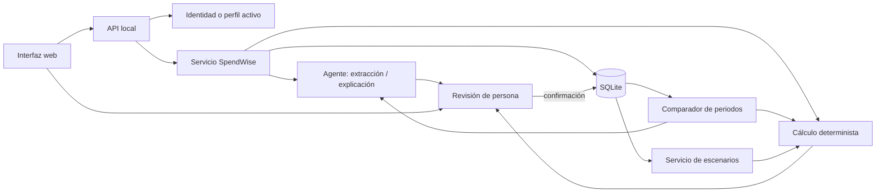

# Guía de desarrollo: historial, comparación y escenarios en SpendWiseAI

**Propósito:** orientar paso a paso la evolución del prototipo actual para que una persona pueda guardar presupuestos mensuales, entender cambios entre meses y explorar metas o eventos con ayuda de un agente.

**Propuesta de producto:** SpendWise conserva el contexto mensual confirmado por cada persona. El agente interpreta los movimientos, hace preguntas y explica patrones con evidencia. El código calcula cifras y la persona revisa los datos y decide qué hacer.

**Principio de diseño que se mantiene:** la IA interpreta, el código calcula y la persona confirma.

---

## 1. Resultado esperado

Al completar esta guía, la aplicación permitirá:

1. Crear o seleccionar un perfil de demostración (primera entrega) y asociar presupuestos a ese perfil.
2. Guardar un presupuesto mensual solo después de la revisión y confirmación humana.
3. Consultar meses anteriores y abrir sus movimientos confirmados.
4. Comparar dos periodos mediante diferencias deterministas de ingresos, gastos, saldos, categorías y movimientos.
5. Pedir al agente una explicación de los cambios, basada exclusivamente en los resultados calculados y los movimientos que los respaldan.
6. Definir una meta financiera o planear un evento, como un viaje, y comparar escenarios estimados sin registrarlos como transacciones reales.
7. Corregir, volver a calcular, guardar como borrador o descartar cualquier escenario.
8. Mantener separados los datos de cada perfil y distinguir claramente datos confirmados, estimaciones y resultados simulados.

## 2. Alcance recomendado

Conviene construir las tres funciones sobre una base común, el historial mensual, y secuenciarlas para reducir riesgo:

| Entrega | Incluye | No incluye todavía |
|---|---|---|
| **MVP de historial** | Perfiles de demostración, almacenamiento persistente local, presupuestos mensuales confirmados y lista de periodos | Cuentas públicas, sincronización en la nube o conexión bancaria |
| **MVP de comparación** | Comparación de dos periodos, explicación del agente y referencias a movimientos de origen | Predicción automática de ingresos o gastos futuros |
| **MVP de escenarios** | Meta de ajuste y plan de evento con supuestos editables, cálculo verificable y comparación de opciones | Recomendaciones de inversión, crédito o decisiones automáticas sobre dinero |

Para una entrega académica, usar perfiles de demostración y SQLite permite mostrar el valor sin asumir que ya existe infraestructura de producción. Si se necesitan cuentas reales, se deben tratar autenticación, sesiones, despliegue y privacidad como trabajo adicional explícito, no como un simple formulario de registro.

## 3. Situación actual y piezas que se pueden conservar

La aplicación ya proporciona una base útil:

- `app.py` sirve la web y expone endpoints HTTP usando la biblioteca estándar.
- `spendwise_service.py` llama al modelo para extraer movimientos, valida el esquema y prepara la revisión humana.
- `confirm_review` exige confirmación, acepta correcciones y produce los movimientos confirmados.
- `spendwise_core.py` contiene cálculos deterministas con `Decimal`, validación del resultado y escenarios de reducción seleccionados por la persona.
- `web/app.js` implementa entrada, revisión y resultado.
- Las sesiones de revisión y el resultado viven actualmente en memoria; expiran después de 30 minutos y se pierden al reiniciar el servidor.
- No hay cuentas, persistencia de presupuestos ni historial mensual.

La evolución debe guardar el resultado confirmado de `confirm_review`, no el `preview` provisional de `prepare_review`. No se debe tratar una extracción del agente como dato histórico hasta que la persona la confirme.

## 4. Arquitectura objetivo



### Responsabilidades

| Parte | Responsabilidad | No debe hacer |
|---|---|---|
| Navegador | Elegir perfil, capturar periodo, editar movimientos, ver historial, comparar y editar escenarios | Calcular totales como fuente de verdad ni decidir qué filas guardar |
| `app.py` / API | Validar solicitudes, identificar perfil, llamar servicios y devolver respuestas | Confiar en un `profile_id` arbitrario recibido desde el cliente |
| Servicio de historial | Crear, listar, consultar, actualizar o eliminar presupuestos autorizados | Guardar un presupuesto antes de confirmación explícita |
| `spendwise_core.py` | Calcular totales, diferencias y costos usando números decimales | Interpretar lenguaje natural o generar consejos libres |
| Agente | Extraer movimientos, estructurar metas/eventos y explicar cambios proporcionados | Inventar importes, recalcular diferencias o ejecutar acciones financieras |
| SQLite | Persistir perfiles, presupuestos, movimientos y escenarios | Ser accesible directamente desde el navegador |
| Persona | Confirmar los movimientos, revisar explicaciones y decidir qué escenario utilizar | — |

## 5. Decisiones técnicas iniciales

Antes de programar, registra estas decisiones en `docs/arquitectura.md`:

1. **Almacenamiento local:** SQLite en un archivo dentro de un directorio de datos explícito, fuera de los estáticos web. Incluir el archivo y sus respaldos en `.gitignore`.
2. **Identidad para el prototipo:** perfiles de demostración seleccionables, sin contraseña, claramente rotulados como perfiles locales de prueba. Un perfil no equivale a autenticación segura para uso público.
3. **Identidad si se requiere acceso real:** cuentas autenticadas con contraseñas almacenadas mediante hash seguro, sesiones protegidas y controles de acceso en servidor. Elegir y documentar biblioteca/proveedor antes de implementarlo.
4. **Periodo:** almacenar `year` y `month` como enteros y derivar una clave `YYYY-MM`; permitir exactamente un presupuesto confirmado por perfil y periodo en la primera versión.
5. **Moneda:** conservar alcance actual de COP. No mezclar monedas ni convertirlas automáticamente.
6. **Versiones:** actualizar un presupuesto de forma explícita. Para una demo simple se puede sobrescribir guardando `updated_at`; si se necesita auditoría, agregar revisiones inmutables después.
7. **Datos del agente:** enviar al proveedor únicamente el periodo y los movimientos necesarios para la pregunta actual, nunca credenciales o identificadores de cuenta.
8. **Retención:** definir dónde vive el archivo SQLite, cómo borrarlo y si los perfiles se eliminan al reiniciar. No afirmar que los datos se eliminan al cerrar el servidor si se adopta persistencia.

## 6. Modelo de datos propuesto

Los siguientes campos describen el contrato lógico. Se pueden ajustar nombres para seguir las convenciones existentes, pero se deben mantener las relaciones y las reglas de propiedad.

### `profiles`

| Campo | Tipo lógico | Regla |
|---|---|---|
| `id` | texto UUID aleatorio | Clave primaria |
| `display_name` | texto | Requerido, longitud limitada |
| `created_at` | fecha-hora ISO 8601 UTC | Se asigna en servidor |
| `profile_type` | texto | `demo` en el prototipo |

### `budgets`

| Campo | Tipo lógico | Regla |
|---|---|---|
| `id` | texto UUID aleatorio | Clave primaria |
| `profile_id` | texto | FK a `profiles.id`; toda consulta se limita por propietario |
| `year` | entero | Rango razonable validado |
| `month` | entero | 1 a 12 |
| `income` | decimal en texto o centavos enteros | `null` si no se conoce; no convertir en cero |
| `currency` | texto | `COP` para el alcance inicial |
| `status` | texto | `confirmed` para historial; los borradores no se comparan |
| `created_at`, `updated_at` | fecha-hora ISO 8601 UTC | Gestionados por servidor |
| `source_mode` | texto | `live` o `fixture`, para distinguir extracción real de ensayo |

Restricción recomendada: `UNIQUE(profile_id, year, month)` para mantener un presupuesto por mes y perfil.

### `movements`

| Campo | Tipo lógico | Regla |
|---|---|---|
| `id` | texto UUID aleatorio | Clave primaria persistente; no reutilizar IDs temporales `m1`, `m2` entre presupuestos |
| `budget_id` | texto | FK a `budgets.id` |
| `description` | texto | Descripción confirmada |
| `amount` | decimal en texto o centavos enteros | COP no negativo, hasta dos decimales |
| `category` | texto | Una de las categorías de `spendwise_core.CATEGORIES` |
| `source_quote` | texto nullable | Cita de origen si el presupuesto vino de extracción; no necesaria para gastos manuales de escenarios |
| `origin` | texto | `interpreted`, `manual` o `scenario` según corresponda |
| `created_at` | fecha-hora ISO 8601 UTC | Se asigna en servidor |

Las devoluciones y monedas distintas de COP continúan excluidas del cálculo conforme a las reglas actuales. Si posteriormente se incorporan, deben modelarse con reglas explícitas y nuevas evaluaciones.

### `scenarios`

| Campo | Tipo lógico | Regla |
|---|---|---|
| `id` | texto UUID aleatorio | Clave primaria |
| `profile_id` | texto | Propietario del escenario |
| `scenario_type` | texto | `goal` o `event` |
| `title` | texto | Nombre visible |
| `period` | texto opcional | Periodo objetivo si aplica |
| `status` | texto | `draft`, `saved` o `discarded` |
| `assumptions_json` | JSON validado | Supuestos editables expresados como datos, no texto ejecutable |
| `calculation_json` | JSON | Resultado generado por código y recalculable |
| `created_at`, `updated_at` | fecha-hora ISO 8601 UTC | Gestionados por servidor |

Para el MVP, guardar escenarios puede dejarse para una iteración posterior; primero se pueden mantener en memoria de interfaz. Si se guardan, etiquetarlos siempre como estimaciones.

### Esquema SQLite inicial orientativo

```sql
PRAGMA foreign_keys = ON;

CREATE TABLE IF NOT EXISTS profiles (
  id TEXT PRIMARY KEY,
  display_name TEXT NOT NULL CHECK(length(display_name) BETWEEN 1 AND 80),
  profile_type TEXT NOT NULL CHECK(profile_type = 'demo'),
  created_at TEXT NOT NULL
);

CREATE TABLE IF NOT EXISTS budgets (
  id TEXT PRIMARY KEY,
  profile_id TEXT NOT NULL REFERENCES profiles(id) ON DELETE CASCADE,
  year INTEGER NOT NULL CHECK(year BETWEEN 2000 AND 2200),
  month INTEGER NOT NULL CHECK(month BETWEEN 1 AND 12),
  income TEXT,
  currency TEXT NOT NULL DEFAULT 'COP' CHECK(currency = 'COP'),
  status TEXT NOT NULL CHECK(status IN ('draft', 'confirmed')),
  source_mode TEXT NOT NULL CHECK(source_mode IN ('live', 'fixture', 'manual')),
  created_at TEXT NOT NULL,
  updated_at TEXT NOT NULL,
  UNIQUE(profile_id, year, month)
);

CREATE TABLE IF NOT EXISTS movements (
  id TEXT PRIMARY KEY,
  budget_id TEXT NOT NULL REFERENCES budgets(id) ON DELETE CASCADE,
  description TEXT NOT NULL CHECK(length(description) BETWEEN 1 AND 200),
  amount TEXT NOT NULL,
  category TEXT NOT NULL,
  source_quote TEXT,
  origin TEXT NOT NULL CHECK(origin IN ('interpreted', 'manual', 'scenario')),
  created_at TEXT NOT NULL
);

CREATE INDEX IF NOT EXISTS idx_budgets_profile_period
  ON budgets(profile_id, year, month);
CREATE INDEX IF NOT EXISTS idx_movements_budget
  ON movements(budget_id);
```

**Decisión sobre montos:** SQLite no tiene un tipo decimal fijo de precisión. Guarda cantidades como centavos enteros o texto decimal canónico; convierte a `Decimal` en Python y valida los límites de `money()`. No uses `REAL` como fuente de verdad monetaria.

## 7. Endpoints previstos

Mantener el estilo de rutas del servidor actual y responder JSON. Toda ruta que lee o cambia datos debe resolver el perfil activo desde una sesión de servidor; no basta con aceptar `profile_id` en el cuerpo.

| Método y ruta | Función | Entrada principal | Respuesta |
|---|---|---|---|
| `GET /api/profiles` | Listar perfiles demo | — | Perfiles seleccionables |
| `POST /api/profile/select` | Seleccionar perfil demo | `profile_id` | Sesión/perfil activo actualizado |
| `GET /api/budgets` | Listar meses guardados | Filtros opcionales de año | Metadatos de presupuestos del perfil |
| `GET /api/budgets/{id}` | Leer un presupuesto y movimientos | ID de presupuesto | Solo si pertenece al perfil activo |
| `POST /api/budgets` | Guardar el presupuesto confirmado | Periodo, ingreso y movimientos confirmados | Presupuesto persistido |
| `PUT /api/budgets/{id}` | Actualizar explícitamente un mes | Datos corregidos | Presupuesto recalculado y persistido |
| `DELETE /api/budgets/{id}` | Eliminar un presupuesto | Confirmación explícita | Estado de borrado |
| `POST /api/compare` | Calcular diferencia entre dos periodos | `budget_a`, `budget_b` | Diferencias calculadas y trazabilidad |
| `POST /api/compare/explanation` | Explicar diferencias | Resultado calculado y consentimiento live si aplica | Explicación estructurada del agente |
| `POST /api/scenarios/interpret` | Interpretar objetivo/evento | Texto del usuario y presupuesto(s) elegido(s) | Preguntas o supuestos estructurados |
| `POST /api/scenarios/calculate` | Calcular escenario | Supuestos editados | Resultado determinista |
| `POST /api/scenarios` | Guardar borrador (opcional) | Escenario validado | Escenario guardado |

El servidor actual usa una clase `BaseHTTPRequestHandler`; una ruta con parámetros debe parsearse con cuidado, normalizarse y validarse. No conviertas una ruta arbitraria en acceso a archivo. Devuelve `404` para IDs que no existen o no pertenecen al perfil, sin filtrar información de otros perfiles.

## 8. Plan paso a paso

### Fase 0 — Preparación y decisiones

1. Confirmar que la primera entrega será local y de demostración o que se requieren cuentas reales. Recomendación: comenzar con perfiles demo.
2. Fijar el alcance: COP, un presupuesto por mes, movimientos de gasto positivos, ingresos opcionales y escenarios separados de transacciones.
3. Actualizar `docs/arquitectura.md` con el diagrama, retención, fuente de verdad y límites del agente.
4. Definir los mensajes de interfaz para distinguir `fixture`, extracción Gemini, presupuesto confirmado y escenario estimado.
5. Crear una lista de migración de datos: el prototipo actual no persiste registros, por lo que no hay un historial existente que importar.

**Listo cuando:** decisiones anotadas, términos de interfaz definidos y contrato de datos revisado por el equipo.

### Fase 1 — Capa de persistencia

1. Crear un módulo nuevo, por ejemplo `spendwise_storage.py`, separado de `app.py` y `spendwise_core.py`.
2. Implementar `get_connection()` con `PRAGMA foreign_keys = ON`, timeout de bloqueo y transacciones explícitas.
3. Implementar `initialize_database()` para crear tablas e índices al arrancar. Para la primera versión se puede usar `CREATE TABLE IF NOT EXISTS`; introducir tabla de migraciones cuando cambie el esquema.
4. Definir ubicación de DB mediante una variable de entorno como `SPENDWISE_DB_PATH`; usar una ruta local por defecto fuera de `web/`.
5. Añadir perfiles demo iniciales de forma idempotente, con nombres y datos ficticios visibles como demostración.
6. Implementar operaciones de almacenamiento parametrizadas: crear/listar perfil, crear/listar/obtener presupuesto, insertar movimientos, actualizar presupuesto y eliminarlo.
7. Usar consultas SQL parametrizadas, nunca construir SQL concatenando valores del usuario.
8. Asegurar que el guardado de presupuesto y todos sus movimientos suceda dentro de una única transacción; si falla una inserción, revertir todo.
9. No guardar API keys, texto bruto completo ni datos financieros en logs.
10. Añadir al `.gitignore` la DB, copias locales y archivos temporales de SQLite.

**Listo cuando:** los datos sobreviven un reinicio local, las FK funcionan y una operación incompleta no deja filas parciales.

### Fase 2 — Perfil activo y límites de propiedad

1. Crear una sesión de perfil con token aleatorio generado en servidor y asociarla al cliente usando cookie `HttpOnly`, `SameSite=Strict` y `Secure` si hay HTTPS. En local HTTP, documentar la excepción de `Secure`.
2. No usar el identificador del perfil enviado en cada request como prueba de autorización.
3. En el prototipo demo, el usuario puede seleccionar un perfil sin contraseña, pero el servidor guarda cuál está activo en su sesión.
4. Cambiar las estructuras de sesión existentes con concurrencia segura y TTL definido; no guardar datos financieros en cookies.
5. Añadir rutas de listar y seleccionar perfil; al cambiar perfil, borrar tokens de revisión y estado temporal asociado al perfil anterior.
6. Para cada lectura/escritura de presupuesto, hacer la consulta con `WHERE id = ? AND profile_id = ?` o una unión equivalente.
7. Responder con un error genérico si el presupuesto no existe o no pertenece al perfil activo.

**Listo cuando:** con dos perfiles de prueba, el perfil A no puede listar, leer, actualizar ni borrar presupuestos del B manipulando IDs o payloads.

### Fase 3 — Guardar un presupuesto confirmado

1. Añadir selector de mes y año al flujo de entrada o a la pantalla de revisión.
2. Mantener el flujo existente de extracción y revisión sin guardar el `preview`.
3. Tras `confirm_review`, ofrecer acción explícita “Guardar este mes”. Incluir periodo y movimientos que el servidor acaba de confirmar.
4. Hacer que el servidor vuelva a validar todos los campos; no confiar en cálculos o IDs enviados desde el navegador.
5. Generar IDs persistentes para presupuesto y movimientos en servidor. No reciclar los IDs temporales de extracción.
6. Calcular el resumen mediante `spendwise_core` con los movimientos validados y almacenarlo junto con sus datos base o recalcularlo al leer. La fuente de verdad son los movimientos e ingreso confirmados.
7. Si ya existe un registro del mismo mes, mostrar opciones explícitas: cancelar o reemplazar/actualizar. No sobrescribir en silencio.
8. Guardar en transacción: presupuesto, movimientos y metadatos del modo fuente.
9. Permitir también carga manual mensual si se desea, marcando cada movimiento como `manual`.
10. Mostrar confirmación con mes, número de movimientos, modo (`real`/`simulado`) y estado guardado.

**Listo cuando:** un registro aparece después de refrescar y reiniciar, el duplicado mensual se maneja claramente y una extracción no confirmada no se persiste.

### Fase 4 — Historial navegable

1. Crear una vista “Mis meses” o “Historial” con periodos ordenados del más reciente al más antiguo.
2. Para cada mes mostrar ingreso, gasto, saldo, cantidad de movimientos, fecha de actualización y etiqueta de origen.
3. Añadir estado vacío útil: indicar cómo crear el primer mes.
4. Añadir carga, detalle, edición y borrado con confirmación. Después de editar, volver a validar y recalcular usando código.
5. Mostrar cuándo un ingreso está ausente y evitar confundir `null` con `$0`.
6. Marcar los periodos incompletos y permitir al usuario decidir si desea compararlos; no ocultar la limitación.
7. Evitar renderizar texto del agente como HTML. Usar `textContent`, como hace actualmente `web/app.js`.

**Listo cuando:** una persona puede abrir, corregir y eliminar sus meses sin perder de vista su perfil ni confundir fixtures con datos live.

### Fase 5 — Comparación determinista

1. Crear funciones puras en `spendwise_core.py` o un módulo dedicado `spendwise_compare.py`.
2. Definir entradas normalizadas: dos presupuestos del mismo perfil, moneda COP, periodos distintos y movimientos confirmados.
3. Calcular por código:
   - diferencia de ingreso, si ambos ingresos están disponibles;
   - diferencia de gasto total y saldo, con convención visible `mes B − mes A`;
   - diferencia por categoría;
   - movimientos nuevos, removidos y cambiados, con estrategia documentada para emparejar descripciones similares;
   - meses con datos faltantes y advertencias que limiten la comparación.
4. No pedir al agente que decida las diferencias numéricas. Esas diferencias salen del código.
5. Diseñar la pantalla de comparación con selector de mes inicial y final, resumen de cambios, variación por categoría y lista de movimientos que explican cada variación.
6. Etiquetar aumentos/reducciones en monto absoluto; agregar porcentaje solo cuando el valor base sea distinto de cero y disponible.
7. Para movimientos no emparejables con confianza, mostrarlos como “posibles cambios” y permitir inspección, sin afirmar que son el mismo comercio.
8. Conservar identificadores de presupuesto y movimiento en la respuesta para que cada observación tenga trazabilidad.

**Listo cuando:** el resultado comparativo puede reproducirse enteramente desde los dos registros y cada cifra coincide con una suma verificable.

### Fase 6 — Explicación del agente con evidencia

1. Definir un esquema JSON de explicación, por ejemplo:

```json
{
  "observaciones": [
    {
      "titulo": "Aumentó transporte",
      "explicacion": "El gasto subió porque aparecen dos viajes adicionales.",
      "diferencia_calculada": 30000,
      "movement_ids": ["...", "..."],
      "confidence": "medium",
      "needs_review": true
    }
  ],
  "limitaciones": []
}
```

2. Enviar al agente las diferencias ya calculadas, categorías y movimientos de ambos periodos necesarios para explicar la variación.
3. Instruir al modelo a no inventar causas, no afirmar que una variación es mala/buena y declarar cuando los datos no prueban una explicación.
4. Validar la respuesta: esquema exacto, importes coherentes con los del cálculo, IDs citados existentes, límites de longitud y campos requeridos.
5. Rechazar o marcar como inválida cualquier observación que cite IDs de fuera de los dos presupuestos o altere diferencias calculadas.
6. Mostrar una explicación provisional hasta que la persona la revise; las cifras deterministas pueden mostrarse antes, pero la causalidad generada por el modelo debe distinguirse.
7. Incluir consentimiento explícito antes de enviar los movimientos al proveedor; indicar que el texto financiero se transmite a Gemini.
8. Registrar modelo, versión de prompt, latencia y modo, evitando guardar entradas sensibles en logs. Mantener modo fixture claramente rotulado.
9. Añadir ejemplos adversariales y casos de evidencia insuficiente a las evaluaciones de extracción/explicación.

**Listo cuando:** el agente explica sin alterar los números, cada afirmación remite a movimientos válidos y puede responder “no hay evidencia suficiente”.

### Fase 7 — Metas y eventos

#### 7.1 Contrato común de escenario

Un escenario debe incluir tipo, título, periodo opcional, fuente presupuestaria, supuestos estructurados, partidas estimadas, totales calculados, advertencias y estado. No insertar sus partidas en `movements` del presupuesto real.

#### 7.2 Meta de ajuste

1. Capturar una petición, por ejemplo: “Quiero liberar 150.000 pesos el próximo mes”.
2. Pedir al agente que convierta la petición a un objeto estructurado: importe objetivo, periodo, categorías protegidas, preferencias y preguntas pendientes.
3. Si hay ambigüedad, preguntar; no asumir ingreso, periodicidad o que un gasto es reducible.
4. Mostrar gastos candidatos del historial como opciones, no como órdenes.
5. Permitir a la persona fijar cuánto reducir por partida o excluir categorías completas.
6. Calcular el resultado con código y mostrar cuánto se aproxima a la meta, con diferencia residual.
7. Etiquetar el resultado como escenario estimado, no ahorro obtenido o garantizado.

#### 7.3 Evento

1. Capturar nombre y fecha aproximada del evento, presupuesto máximo o meta de gasto y rubros relevantes.
2. Pedir al agente que extraiga los rubros y datos faltantes; los importes sugeridos por el agente son supuestos por confirmar.
3. Dejar editar cada partida y añadir notas/fuentes, por ejemplo una cotización introducida por la persona.
4. Calcular suma del evento y efecto frente al saldo disponible del periodo elegido.
5. Ofrecer alternativas editables: presupuesto máximo, número de participantes, duración o rubros. Cada alternativa debe indicar qué supuesto cambió.
6. Mostrar claramente si el historial no contiene ingreso confirmado suficiente para estimar el saldo.
7. No guardar un costo como gasto real hasta que la persona lo registre como movimiento confirmado en el periodo correspondiente.

#### 7.4 Persistencia de escenarios

Para una primera demo, mantener escenarios activos en la interfaz y permitir descarga JSON. Para conservarlos entre sesiones, implementar tabla propia de escenarios vinculada al perfil; guardar supuestos y resultados en formato versionado para poder recalcularlos si cambia el código.

**Listo cuando:** modificar un supuesto actualiza el escenario mediante el backend, las cifras cuadran y ninguna partida estimada aparece en el resumen de movimientos reales.

### Fase 8 — UX y navegación

Organizar la aplicación en cuatro áreas:

1. **Registrar:** entrada de texto, selección de mes, interpretación, revisión y confirmación.
2. **Historial:** periodos guardados, detalle y edición.
3. **Comparar:** seleccionar dos meses, ver cálculo y solicitar explicación del agente.
4. **Planear:** elegir una meta o evento, responder preguntas y ajustar escenarios.

Detalles de interfaz necesarios:

- Perfil activo visible en todo momento y control de cambio.
- Estados distintos: `sin guardar`, `confirmado`, `guardado`, `simulado`, `estimado`, `pendiente de revisar`.
- Moneda y convención de comparación visibles.
- Acciones destructivas con confirmación y mensajes de resultado.
- Errores del proveedor comprensibles y recuperación sin borrar datos ya guardados.
- Vistas adaptables a pantalla pequeña y controles con etiquetas accesibles.
- Navegación que no deje cambios sin guardar sin advertir a la persona.

### Fase 9 — Calidad y evaluaciones

Extender la evidencia existente en `tests/`, `evals/` y `verify.py` con estos grupos:

1. **Almacenamiento:** creación, recuperación, actualización, borrado, restricciones únicas, rollback y persistencia tras reinicio.
2. **Aislamiento:** lecturas y mutaciones entre perfiles; manipulación de IDs; sesión expirada.
3. **Presupuestos:** periodo inválido, mes duplicado, ingreso ausente, monto límite, categorías no admitidas, movimientos vacíos y fila omitida.
4. **Comparación:** mismo periodo, orden invertido, categoría nueva, monto cero, ingreso ausente, descripción ambigua, movimientos añadidos/eliminados y redondeo decimal.
5. **Explicaciones:** IDs desconocidos, cifra alterada, evidencia insuficiente, salida malformada, inyección de instrucciones en descripciones y fallo del proveedor.
6. **Escenarios:** supuestos faltantes, total incorrecto, cantidades negativas, metas imposibles, categoría protegida, costo de evento y separación entre real/estimado.
7. **Navegador:** guardar, refrescar, reiniciar, cambiar perfil, comparar, crear escenario y descargar resultados.
8. **Privacidad:** no registrar cuerpos financieros ni claves; consentimiento visible para llamadas al proveedor; borrar perfil y datos asociados conforme a la política del prototipo.

No interpretar fixtures manuales como evidencia de calidad del modelo real. Reportar claramente ejecución local, Gemini real y pruebas con participantes como evidencias distintas.

### Fase 10 — Validación con personas y presentación

1. Reclutar usuarios apropiados al contexto académico y explicar el carácter de prototipo.
2. Usar perfiles y movimientos sintéticos; no solicitar claves bancarias ni datos financieros reales.
3. Observar si entienden que el historial corresponde al perfil seleccionado, si pueden encontrar cambios y si reconocen estimaciones.
4. Pedirles comparar dos meses y luego planear una meta o un evento.
5. Registrar errores, confusiones, ayudas necesarias y comentarios anonimizados; no inventar resultados.
6. Actualizar `docs/validacion_usuarios.md` con protocolo adaptado, fecha y resultados reales.
7. Actualizar `docs/pitch_6_minutos.md` y `web/pitch.js` para demostrar un recorrido conectado: guardar mes A, guardar mes B, explicar el cambio y explorar un plan.
8. Usar datos ficticios en la presentación y mostrar qué partes son simuladas.

## 9. Orden de trabajo recomendado

La secuencia mínima para construir algo demostrable:

1. Definiciones de producto y contrato de datos.
2. SQLite y módulo de almacenamiento.
3. Perfiles demo y comprobación de aislamiento.
4. Guardar presupuesto después de confirmar.
5. Historial, detalle y edición.
6. Cálculo y pantalla de comparación.
7. Explicación estructurada del agente con referencias.
8. Meta de ajuste.
9. Evento.
10. Persistencia opcional de escenarios.
11. Accesibilidad, validación con personas y actualización del pitch.

El orden implementa una base común y evita construir explicaciones o escenarios sobre datos que todavía no se pueden recuperar.

## 10. Definición de terminado por funcionalidad

### Presupuesto e historial

- Solo un presupuesto confirmado puede entrar al historial.
- Mes y año son obligatorios; monto, categorías y propiedad se validan en backend.
- Un mes duplicado produce una decisión visible.
- Una actualización recalcula el resumen desde los movimientos.
- Borrado elimina o invalida movimientos relacionados conforme a la política definida.

### Comparación

- El usuario selecciona dos periodos del mismo perfil.
- El servidor devuelve cifras calculadas y metadatos de datos faltantes.
- La convención de signos es clara y uniforme.
- Cada fila puede abrir movimientos de origen.
- El modelo no es la fuente del cálculo ni puede cambiar montos.

### Explicación

- Las afirmaciones incluyen IDs válidos o se marcan sin respaldo.
- El agente puede comunicar incertidumbre o ausencia de evidencia.
- El texto se muestra como texto seguro, no HTML.
- Si Gemini falla, el resultado numérico de comparación sigue disponible.

### Escenarios

- Supuestos editables y trazables.
- Resultado recalculado por backend.
- No se mezclan gastos estimados con transacciones confirmadas.
- No se presentan como garantías ni como consejo de inversión/crédito.
- Se puede descartar el escenario sin alterar el historial.

## 11. Riesgos y mitigaciones

| Riesgo | Mitigación concreta |
|---|---|
| Perfil demo confundido con cuenta segura | Etiqueta visible “perfil local de demostración”; no usar para servicio público |
| Acceso cruzado entre perfiles | Resolver identidad en servidor y filtrar cada query por propietario; pruebas negativas |
| DB o datos de prueba enviados al repositorio | Ruta fuera de estáticos, `.gitignore`, datos sintéticos |
| Precisión monetaria | Centavos enteros o decimal canónico; `Decimal`; no usar `float` en persistencia/cálculo financiero |
| Explicación causal inventada | Dar al agente diferencias y movimientos; exigir referencias y “evidencia insuficiente” |
| Comparar periodos incompletos | Metadatos de faltantes y aviso; permitir cancelar comparación |
| Descripciones similares emparejadas erróneamente | No afirmar igualdad; mostrar “posible coincidencia” y permitir revisión |
| Escenario confundido con realidad | Tabla/objeto aparte, color y etiquetas propias, nunca insertarlo automáticamente en movimientos |
| Envío inesperado de historial al proveedor | Consentimiento contextual, mínimo de datos, explicar qué se envía |
| Pérdida de datos locales | Backups opcionales y acción para exportar/borrar; documentar ubicación del archivo |
| Complejidad de cuentas reales | No llamar autenticación a un selector demo; posponer cuentas o usar solución mantenida y revisar seguridad |

## 12. Decisiones pendientes del equipo

Antes de comenzar la implementación, completar estas respuestas en una reunión corta:

- ¿La demo requiere perfiles ficticios o autenticación con registro real?
- ¿Se permite un presupuesto por mes o se deben admitir varias versiones/importaciones?
- ¿Se deben conservar las citas originales de la entrada en la base de datos? ¿Por cuánto tiempo?
- ¿Qué ocurre al reabrir un mes: edición directa o nueva versión con historial de cambios?
- ¿Los escenarios se guardan en la primera demo o solo se descargan?
- ¿Qué rubros mínimos tiene un evento y qué fuentes pueden proporcionar importes?
- ¿Qué perfil de datos se enviará a Gemini para explicación y qué consentimiento se mostrará?
- ¿Dónde se almacenará y cómo se eliminará la base de datos durante una demo?

Recomendación por defecto para completar el curso: perfiles demo, un presupuesto por mes, guardar solo datos revisados y confirmados, conservar citas solo si aportan trazabilidad, escenarios no persistentes inicialmente y datos sintéticos.

## 13. Checklist de primera semana de implementación

- [ ] Acordar alcance y registrar las decisiones técnicas.
- [ ] Diseñar los objetos `profile`, `budget`, `movement` y `scenario`.
- [ ] Implementar y revisar esquema SQLite y restricciones.
- [ ] Implementar `spendwise_storage.py` con transacciones parametrizadas.
- [ ] Crear perfiles demo idempotentes.
- [ ] Añadir endpoint para listar/seleccionar perfil.
- [ ] Verificar aislamiento con dos perfiles.
- [ ] Añadir selector de periodo al flujo de revisión.
- [ ] Añadir acción explícita para guardar presupuesto confirmado.
- [ ] Añadir vista de historial con datos sintéticos.
- [ ] Probar reinicio, duplicado mensual y borrado.
- [ ] Actualizar README con ubicación de DB y comportamiento de retención.

## 14. Cambios documentales que acompañan al código

Cuando se implementen las fases, actualizar:

- `README.md`: cómo iniciar, crear perfiles demo, ubicar la DB y borrar datos locales.
- `docs/arquitectura.md`: arquitectura persistente, flujo de comparación y límites de seguridad.
- `docs/gates.md`: gates de persistencia, propiedad, comparación, explicación y escenarios.
- `docs/validacion_usuarios.md`: tareas de comparación/planificación y evidencia observada.
- `docs/pitch_6_minutos.md` y `web/pitch.js`: demo completa y rótulos de real/simulado/estimado.

Esta guía describe el objetivo y el orden de trabajo; no afirma que las funciones nuevas ya estén implementadas ni que el prototipo sea apto para producción.
