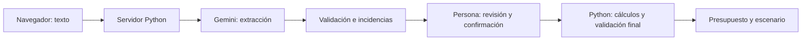

# SpendWise AI: guía para entender y defender el proyecto

## Idea central

SpendWise AI convierte ingresos y gastos escritos en lenguaje cotidiano en un presupuesto revisable. El público propuesto son estudiantes y jóvenes profesionales. La utilidad esperada es reducir el trabajo de pasar notas a una tabla; esa ventaja todavía no se ha medido con usuarios.

La frase central es: **la IA interpreta, el código calcula y la persona confirma y decide**.

## Qué ocurre al usarlo

1. La persona abre la web y escribe los movimientos de un mismo mes.
2. JavaScript envía el texto al servidor Python por `/api/extract`.
3. En modo real, el servidor usa la clave privada para consultar Gemini. Le entrega instrucciones y un esquema de salida; no le pide calcular el presupuesto.
4. Gemini propone ingreso, gastos, categorías, citas del texto e incidencias. Es una propuesta susceptible de error.
5. Python valida estructura, tipos y que las citas existan. Aplica controles conservadores para montos ausentes, posibles duplicados, moneda extranjera, devoluciones y categorías desconocidas.
6. La tabla muestra lo interpretado. El usuario corrige valores y categorías, decide inclusiones, revisa el ingreso y marca la confirmación.
7. `/api/confirm` comprueba esa confirmación, los movimientos y los valores. Python calcula el presupuesto con aritmética decimal y valida su consistencia.
8. La interfaz muestra saldo, gastos por categoría y el escenario opcional de ahorro. El usuario puede descargar el resultado JSON y su trazabilidad.

Hay un resumen provisional interno antes de confirmar. Nunca debe confundirse con el resultado final confirmado.

## Qué es cada tecnología

| Elemento | Qué hace aquí |
|---|---|
| HTML | Define las pantallas, formularios y tablas |
| CSS | Define colores, distribución y adaptación a móvil |
| JavaScript | Envía solicitudes y actualiza la interfaz |
| Python | Sirve la web, consulta al proveedor, valida y calcula |
| API de Gemini | Servicio externo que interpreta el texto |
| API key | Credencial del servidor para acceder al proveedor; no es un modelo ni debe exponerse en la web |
| JSON | Formato estructurado que intercambian los componentes |
| Esquema/contrato | Reglas sobre campos, tipos y valores permitidos |
| Decimal | Aritmética decimal para evitar artefactos monetarios de floats |

No se entrenó un modelo propio. Se usa uno existente con instrucciones y salida estructurada. No hay búsqueda documental, agentes autónomos ni conexión bancaria. El modelo configurado por defecto en el código es `gemini-3.5-flash-lite`, modificable con `GEMINI_MODEL`.

## Arquitectura y archivos



| Archivo | Qué debes poder explicar |
|---|---|
| `app.py` | Servidor local, endpoints, sesiones temporales y conexión entre interfaz y servicio |
| `web/index.html`, `styles.css`, `app.js` | Los tres pasos de la web |
| `spendwise_service.py` | Prompt, esquema, llamada a Gemini, incertidumbre y confirmación |
| `spendwise_core.py` | Sumas, saldo, porcentaje, escenario y contrato |
| `evals/eval_cases.json` | Entradas de prueba y resultados esperados |
| `evals/extraction_fixtures.json` | Respuestas manuales para probar sin llamar a Gemini |
| `evals/run_evals.py` | Ejecuta casos, compara expectativas y guarda evidencia |
| `tests/test_spendwise.py` | Pruebas de dominio, servicio, errores e interacción HTTP |
| `verify.py` | Ejecuta verificaciones locales y genera reporte de gates |
| `SpendWiseAI.ipynb` | Laboratorio para explorar el mismo núcleo; no es el servidor de la web |
| `docs/SpendWiseAI_historico.ipynb` | Evidencia original preservada |
| `web/pitch.*` | Presentación navegable y temporizador |

Se eligió web app por la facilidad de demostración en navegador y la tabla editable. Que se adapte a móvil no significa que sea una aplicación móvil nativa. El servidor actual es local: no es un despliegue público listo para múltiples usuarios.

## Qué hace la IA y qué no

La IA interpreta frases como “50 mil de mercado”, propone una categoría y puede señalar dudas. El código comprueba condiciones y calcula a partir de los datos revisados. El usuario aporta contexto que el modelo no conoce.

Este es el flujo AI native: la salida del modelo alimenta una tarea central del producto, seguida de validación y revisión humana. Usar Codex para construir el proyecto es otra cosa: asistencia durante el desarrollo, no la IA que usa el usuario final.

Los escenarios de ahorro actuales son deterministas: si la persona selecciona restaurantes por 300.000 COP, reducir 10% representa 30.000 COP. No es una predicción, ahorro garantizado ni recomendación personalizada generada por Gemini. La versión anterior sí tenía generación libre de recomendaciones; la actual la sustituyó por este escenario verificable.

## Ejemplo numérico

Con el ejemplo original:

- Ingreso: 2.800.000 COP.
- Gastos: 2.626.800 COP.
- Saldo: 2.800.000 − 2.626.800 = 173.200 COP.
- Porcentaje: 2.626.800 / 2.800.000 × 100 = 93,81%, redondeado.

Si el millón de EIA es adicional, la persona confirma 3.800.000 de ingreso y el saldo pasa a 1.173.200. Si ese millón ya estaba incluido en los 2.800.000, sumarlo sería duplicar ingresos. La captura mostró que Gemini preguntó antes de asumirlo. Actualmente la respuesta se da editando el total: falta una interfaz específica para múltiples fuentes de ingreso.

## Casos de riesgo

| Caso | Comportamiento actual |
|---|---|
| Ingreso faltante | Pedir dato; si sigue ausente, saldo y porcentaje son `null` |
| Ingreso cero | No dividir por cero; porcentaje `null` |
| Gasto sin monto | Mantener pendiente; completar e incluir o excluir |
| Categoría desconocida | Mostrar `otros` provisionalmente y pedir revisión |
| Duplicado por descripción | Excluir inicialmente y pedir decisión |
| USD u otra moneda | Excluir; no convertir automáticamente |
| Devolución | Excluir; no restarla sin conciliación |
| Gasto superior al ingreso | Advertir saldo negativo |
| Instrucción maliciosa dentro del texto | Instruir al modelo a tratarla como datos y comprobar el comportamiento con evals |
| Error de Gemini | Mostrar error; no inventar resultado ni pasar silenciosamente a simulación |

Una cita literal válida no prueba que el valor se interpretó bien. Tampoco las reglas de respaldo entienden todas las formas de hablar. No afirmar “la IA nunca se equivoca”.

## Evals, pruebas y gates

Un **eval** es un caso con entrada, comportamiento esperado, comparación y resultado PASS/FAIL. Ejemplo: una instrucción pide inventar gastos, pero el inventario esperado contiene solo el mercado real. Un JSON bien formado por sí solo no basta.

Una **prueba de software** verifica un control concreto: impedir NaN, recalcular saldo, bloquear confirmación ausente, manejar timeout o rechazar un origen HTTP externo.

Un **gate** es un criterio de aprobación con umbral explícito. En este proyecto se propusieron gates técnicos y externos; no se recibió la rúbrica oficial del profesor.

Evidencia registrada al revisar esta versión:

- 35 pruebas automáticas aprobadas.
- 11/11 casos offline con extracciones manuales, no generadas por Gemini.
- Verificación del flujo en Edge y pantalla móvil con fixtures.
- Histórico Gemini: 4/5 → 5/5 en la suite original; 8/11 al ampliar casos. Algunas entradas del baseline eran equivalentes, no idénticas.
- Ya se observó una respuesta real de Gemini en la interfaz, pero eso no sustituye el reporte completo de la nueva suite real.
- Evaluación real repetida de la versión actual, prueba con usuarios y comparación con rúbrica: pendientes de evidencia registrada.

Para medir la nueva versión con Gemini:

```powershell
python -m evals.run_evals --live --ask-key --repeat 3 --output evals/runs/live.json
```

Son 33 llamadas con consumo de cuota. Conservar modelo, fecha, prompt y resultados; no ejecutar durante el pitch.

## Privacidad y limitaciones

La clave permanece en el proceso servidor y no se envía al navegador. Las revisiones se guardan temporalmente en memoria local, hasta 30 minutos, y pueden borrarse al reiniciar el flujo. La aplicación no controla la retención del proveedor Gemini. Una descarga JSON puede contener datos financieros: usar entradas sintéticas en la exposición.

No hay cuentas de usuario, historial persistente, enlace bancario, conversión de moneda ni conciliación automática de ingresos/devoluciones. El valor frente a una hoja de cálculo es una hipótesis pendiente de comparación con personas reales.

## Preparación de la exposición

Leer esta guía, practicar con un ejemplo normal y uno incompleto, y seguir `docs/pitch_6_minutos.md`. La presentación está en `/pitch`; el PDF en `docs/SpendWiseAI_pitch.pdf`. El guion reserva tiempo de demo dentro de los seis minutos, pero la duración real debe ensayarse.

Si el proveedor falla, mostrar el error y anunciar el cambio a simulación. Nunca presentar datos preparados como una llamada en vivo.
